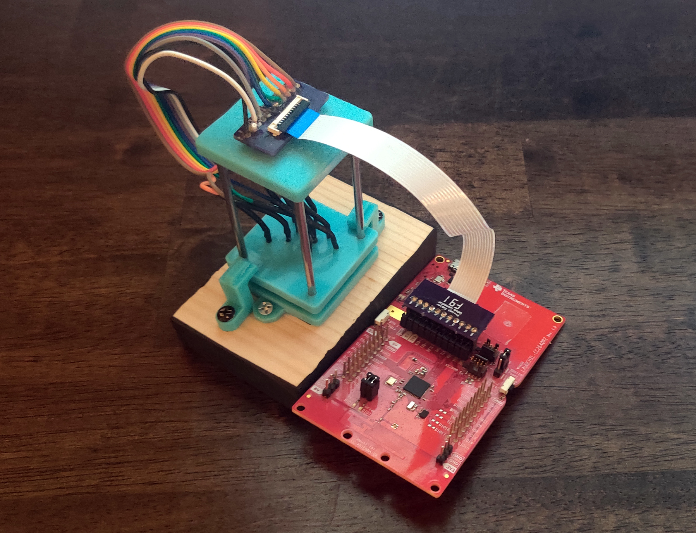
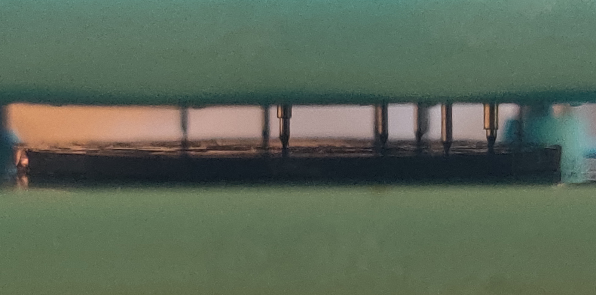

# Kepler HW

Found here are the PCB files as well as 3D parts that were made to accommodate this project.

## Main PCB
The PCB was designed using [Diptrace](https://diptrace.com/). The free version was enough for this entire project. The design is not extremely complicated and was based off the development board and design requirements mentioned in the CC2640 Datasheet.

My first design for the board used FPC connectors for the display (4 pin) as well as one for programming/debugging (11 pin). This was later changed to use the Molex board to board connector for the display and small connection points across the PCB for programming/debugging. These changes were made to save room and make it easier to not have to solder and unsolder an FPC connector for programming/debugging. The connection points are hard to see in the real images, but are visible in the render seen in Figure 3 below. The PCB is only two layers and was printed by [OSHPark](https://oshpark.com/) at 0.8mm. This thickness was a little thicker than the original 0.6mm board, but at the price and speed of the service it couldn't be beat. Yes, you can get 0.6mm boards from services such as PCB Way for cheaper, but the shipping costs a ton (at least at this time) and takes forever. The TI design requirements also suggest an 0.8mm board if memory serves me right...

  
   <b>Figure 1</b>: Old design on the left and new design on the right.

  
   <b>Figure 2</b>: Back of old and new design.

  
   <b>Figure 3</b>: Render of PCB with connection points visible.

## Display Adapter
The display adapter was designed to take the 28 pins of the SSD1306 OLED display and bring them down to an easy to use I2C interface. My original design was intended to pair with the FPC connector on the main PCB, but it was too bulky. The second design is much slimmer, easy to manage, and uses a molex board to board connector which so far has worked much better than the FPC connection. One thing to note is that it was an absolute pain to solder those molex connections by hand. 

  
   <b>Figure 4</b>: First display adapter and second design.

## 3D Parts

### Movement Holder
The original goal for this project was to only change the PCB and display, but the further I got into it the more I realized it's going to be a pain in the ass to use the original movement holder. I tried multiple methods of sanding down and cutting out bits of it, see Figure 5, but it was just a mess and frustrating to work with, so I invested in a resin printer (Hurray, more shit to learn). Once I got a feel for [Fusion 360](https://www.autodesk.com/products/fusion-360), I designed a new movement holder that made life much easier. The new movement holder hugged the PCB perfectly and I was still able to use the original battery clamp, see Figure 9, which made it look so nice! Looking at Figure 6 it's clear how much room I gained from moving away from the original holder. The only part now that was still a little "janky" was that I had to sand down the edges of the SSD1306 Display to make it fit in the case. You can see the sanded rough edges in Figure 8. It's not terrible and much better than murdering the original case, with these changes the case and caseback remained original!

  
   <b>Figure 5</b>: Original movement holders.

  
   <b>Figure 6</b>: Original movement holder on the left and new one on the right.

  
   <b>Figure 7</b>: PCB sitting perfectly within new movement holder.

  
   <b>Figure 8</b>: Display sitting in new movement holder.

  
   <b>Figure 9</b>: Original battery clamp on the new PCB & movement holder.

  
   <b>Figure 10</b>: Display connection to the PCB.

  
   <b>Figure 11</b>: Perfect fit of the new movement.

  
   <b>Figure 12</b>: Completed Build.

### Programming Jig
Moving away from the 11 pin FPC connector that was on my old design to the new 10 connection points on the PCB meant I needed a jig that can be easily used to program/debug the PCB. My original plan was to use acrylic sheets and dremel some holes in it which would house some tiny pogo pins, but now that I had my hands on a resin printer I designed a jig that can save me a ton of time and look way better than cutting acrylic by hand. The design I came up with can bee seen in Figure 13. It used some [very small spring loaded pogo pings](https://www.amazon.com/gp/product/B08NSKWJTQ/ref=ppx_yo_dt_b_asin_title_o05_s00?ie=UTF8&psc=1) that press against the connection points on the PCB as seen in Figures 14 & 15. This programming jig easily paired with the TI Launchpad and I was able to program the watch from there.

  
   <b>Figure 13</b>: Jig used to program the PCB.

  
   <b>Figure 14</b>: Tiny spring loaded pogo pins that make the connection to the PCB.

  
   <b>Figure 15</b>: Close up of the pogo pins in action.

## Parts & References
- [SSD1306 0.83" OLED Display](https://www.buydisplay.com/0-83-inch-oled-display-module-spi-ssd1306-controller-blue-on-black-96x39)
- [Pogo Spring Pins (Test Probes)](https://www.amazon.com/gp/product/B08NSKWJTQ/ref=ppx_yo_dt_b_asin_title_o05_s00?ie=UTF8&psc=1)
- [Rods for Programming Jig](https://www.amazon.com/dp/B07KT1N99L/ref=sspa_dk_detail_1?psc=1&pd_rd_i=B07KT1N99L&pd_rd_w=XpGHF&pf_rd_p=085568d9-3b13-4ac1-8ae4-24a26c00cb0c&pd_rd_wg=nxSRg&pf_rd_r=QZZKPD38YHW4ZKY2T5ZW&pd_rd_r=e5cce05d-6b3a-4f2b-98f6-631da0bc1010&spLa=ZW5jcnlwdGVkUXVhbGlmaWVyPUFQQkhYOENZODRaN1gmZW5jcnlwdGVkSWQ9QTA0NTQzNjkxM01ISllOSVRPSE9DJmVuY3J5cHRlZEFkSWQ9QTAyNDMwOTYxMk5XQ1hERVQ4UVZOJndpZGdldE5hbWU9c3BfZGV0YWlsJmFjdGlvbj1jbGlja1JlZGlyZWN0JmRvTm90TG9nQ2xpY2s9dHJ1ZQ==)

- [3D Resin Printer (Elegoo Mars 2)](https://www.amazon.com/ELEGOO-Photocuring-Monochrome-Off-Line-5-1x3-1x5-9in/dp/B08L9JM11J/ref=sr_1_3?dchild=1&keywords=mars+2&qid=1620368570&sr=8-3)