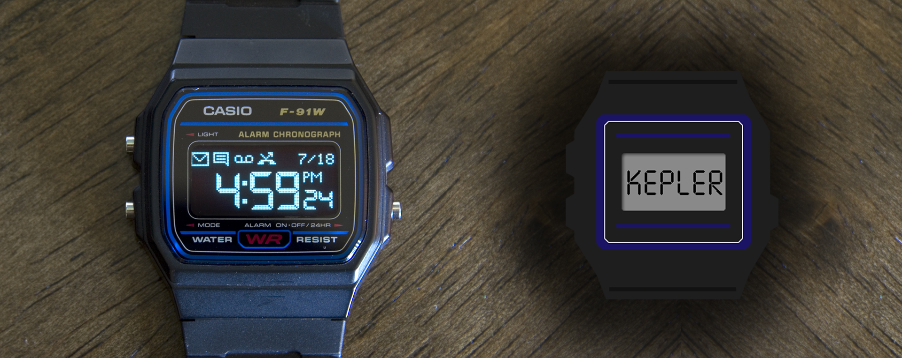
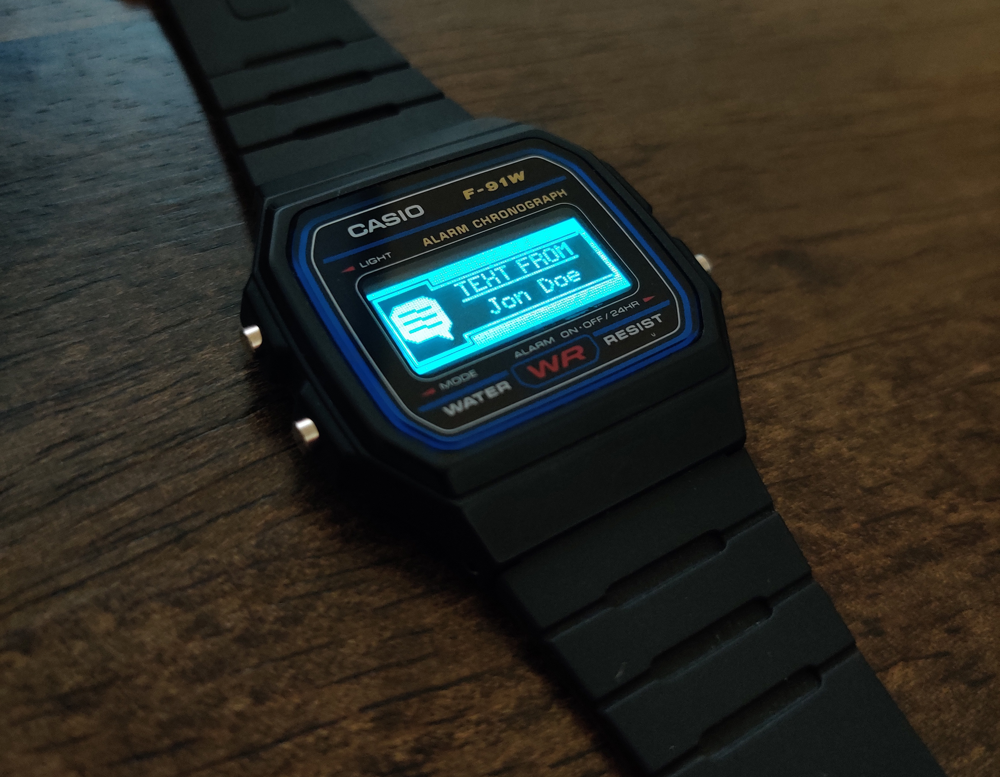

# F91 Kepler

  

The F91 Kepler is complete redesign of the classic Casio F91W watch. This project completely replaces the original internals of the watch only keeping the original case and adding an OLED display and a bluetooth capable MCU.

This repo contains all the firmware, hardware, and completely unfinished software (phone app) ;).

## As of 7/18/22 the current state of the project is:
- Bluetooth capable and supports several calls.
- Only operates through bluetooth diagnostic apps such as nRF Connect.
- Full screen notifications for calls/texts.
- Notifications bar.
- Only one button currently supported to wake screen.
- Battery life of roughly 15 days with waking screen several times a day.

## To-do / improvements:
- Create phone app to handle sending ble calls automatically.
- Add ability to set time through buttons.
- Add sound capabilities. 
- Improve battery life and effiency.
- Improve programming jig (make it easier to do without having to completely dismantle)
- Make rechargeable

### At this point (read more like a year ago) I am burnt out from this project and now I figured to open it up and hopefully more people can be involved.

  

### Contact
devPegor@gmail.com
